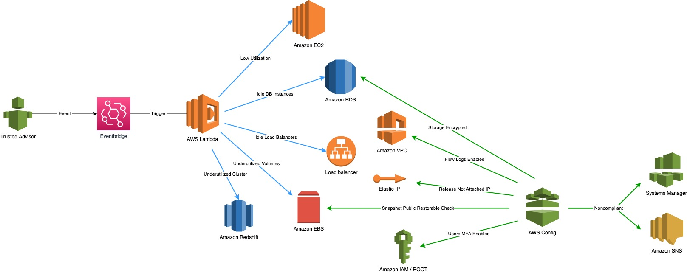

# AWS Best Practices Remediation

There are top 10 very popular checks configured
*  Low Utilization Amazon EC2 Instances
*  Amazon VPC Flow Logs Enabled
*  Amazon EBS Snapshot Privated
*  Amazon IAM User MFA Enabled
*  ROOT Account MFA Enabled
*  Amazon RDS 
*  *Idle Load Balancers (TBD)*
*  *Underutilized Amazon EBS Volumes (TBD)*
*  *Amazon RDS Idle DB Instances (TBD)*
*  *Underutilized Amazon Redshift Clusters (TBD)*

## Architecture Diagram



## Deploy the sample application

```
$ cdk deploy "*"
```